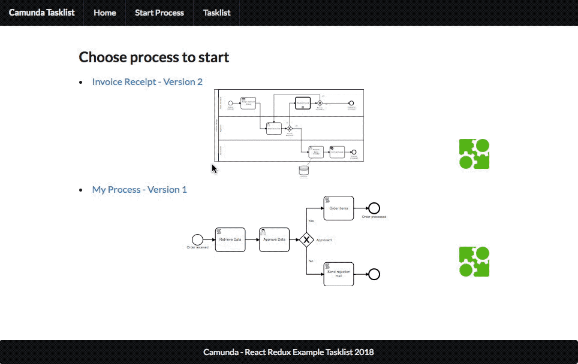

# Camunda - Tasklist

This project shows how one can use React Redux with the standard Camunda REST API. It is an example implementation of how one could build a Tasklist for Camunda using Front End technology only.

The Task Forms are defined within this application and not on the Server-Side to make it very easy to use.

This project was bootstrapped with [Create React App](https://github.com/facebookincubator/create-react-app).
Please see the [React Scripts Guide](https://github.com/facebookincubator/create-react-app/blob/master/packages/react-scripts/template/README.md) to see what you can do with this project from the React perspective.

## Example
Within this project you can find some example task forms that were defined for an example process.
The example process can be found in the folder `examples/myprocess`.
The forms can be found in `src/components/forms/myprocess`.

## How to use
This project can be seen as an example implementation or as a starting point for your custom Tasklist.
As it uses standard react mechanisms it should be very easy for a React developer to adapt and change or reuse the code.

### How to run the example process

1. Prerequisite: Install [NPM](https://docs.npmjs.com/getting-started/installing-node) or [Yarn](https://yarnpkg.com/lang/en/docs/install/)
1. run `npm install` or run `yarn install`
1. run `npm run start` or `yarn start`
1. Start the Camunda Engine (standard distribution with REST-API at `localhost:8080/engine-rest`)
1. Open Browser (e.g. Chrome) on `locahost:3000`
1. Deploy the example BPMN Process given in `examples/myprocess` using the example Tasklist
1. Start Instance & fill in forms
1. Click on Tasklist and complete tasks

